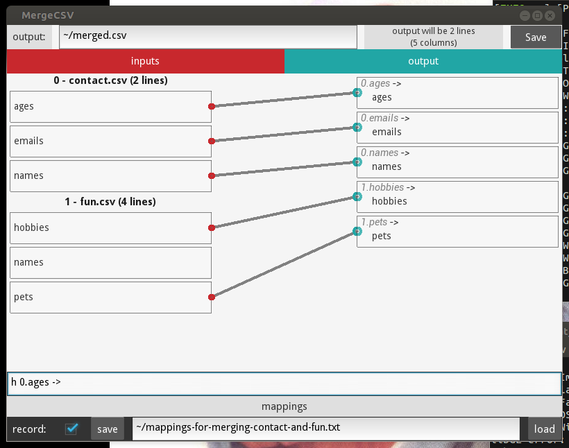

# Merge CSV

A simple [Kivy](http://kivy.org) application for merging CSV files.

This is not a particularly "clean" or well-structured application.  I share it in case it may be useful or inspire some idea.

## Usage

python main.py CSV_INPUT_ONE CSV_INPUT_TWO . . . CSV_INPUT_N

To remove a field from the output, double-click on the field in the output column.

To add or redirect a field in the input, either double-click on the input field twice, or double-click once, enter the name your want the field to have in the output, and press enter.

## Screenshot

